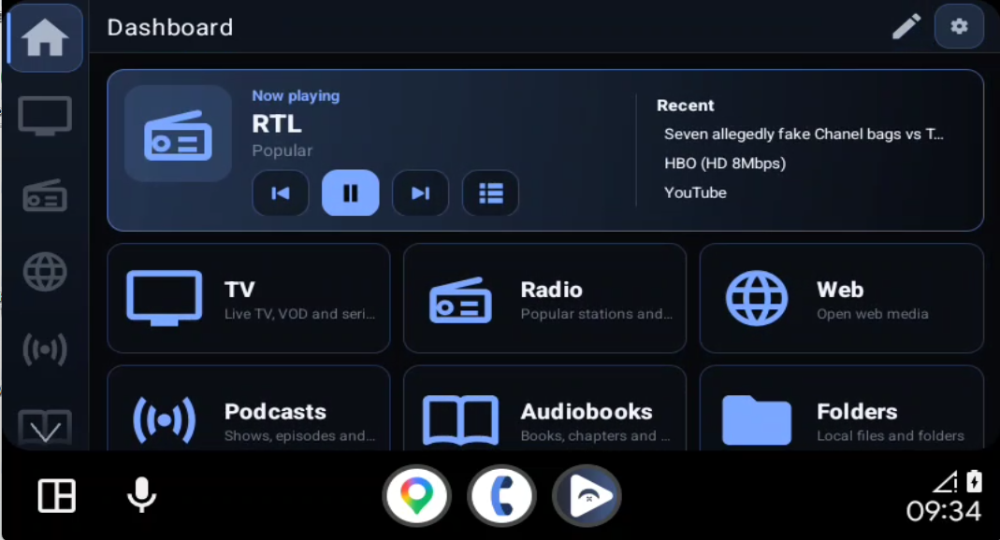
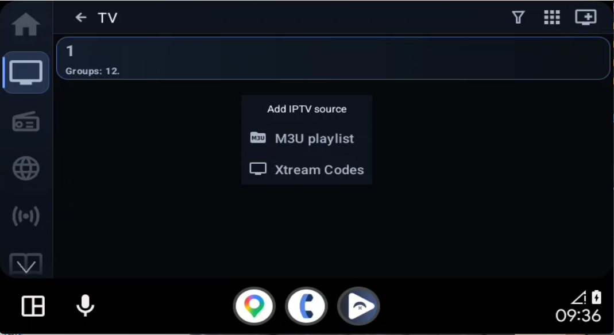
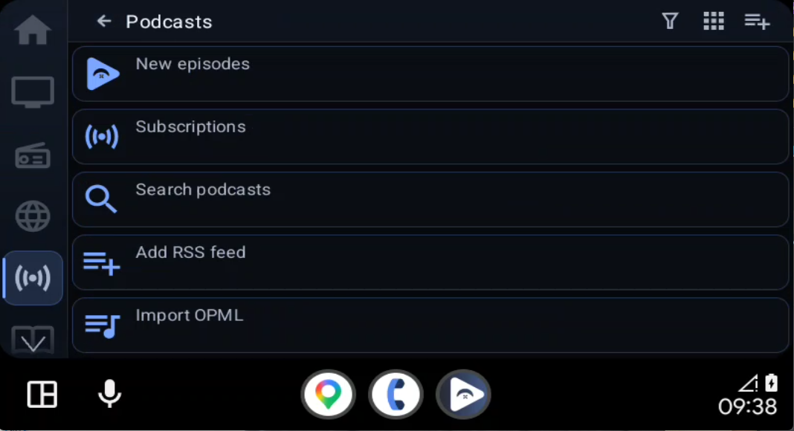
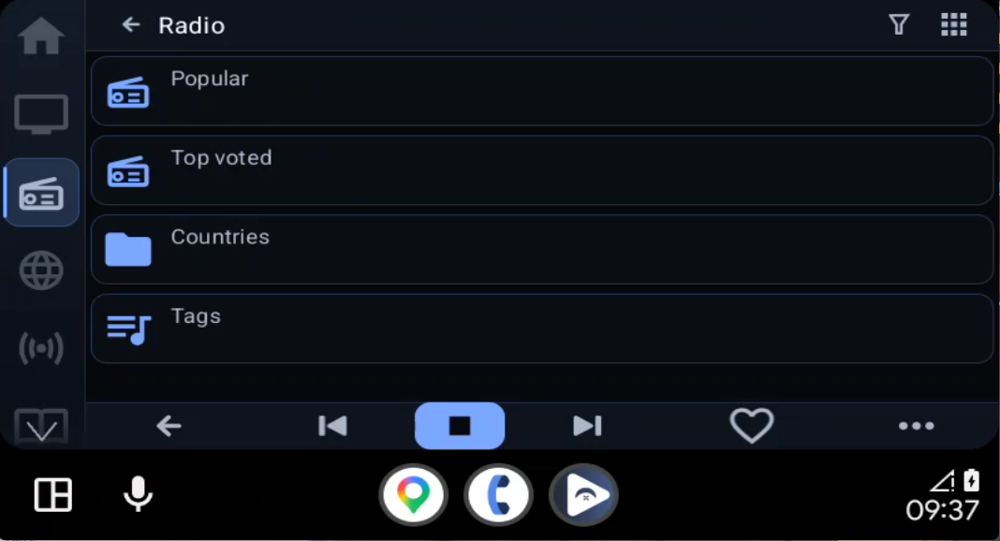

  

  <h1>FermataX</h1>

  

    A free and open source media hub built for Android Auto.
  

  

    
    
    
    
  

> [!IMPORTANT]
> FermataX is free and open source. If you paid for the app through an unofficial website or seller, you may have been scammed.

## About

FermataX is a GPL-3.0 fork of [Fermata Media Player](https://github.com/AndreyPavlenko/Fermata), customized as a car-friendly media hub for Android Auto.

It brings local media, IPTV and Xtream, Internet Radio, Podcasts, Audiobooks, Stremio-compatible services, YouTube and Web media together in one interface. Favorites, Recent, playback progress, voice control, and media controls are integrated across supported sources.

## Continuous integration

Every pull request targeting `main` and every push to `main` runs the repository's verification pipeline. CI executes the Mobile and Auto unit suites, the `MediaSessionCallback` architecture hotspot guard, Android Lint, and a three-dot `git diff --check` against the pull-request base (or push base). The workflow verifies source and tests only; it does not build, sign, publish, or upload release APKs.

## Highlights

- **Dashboard-first interface** designed for quick access on Android Auto screens.
- **Left or right navigation rail** with customizable and scrollable items.
- **SmartTopCard** with Now Playing, Continue, and recent media.
- **Local audio and video** playback with folders and playlists.
- **IPTV and Xtream Codes** with M3U, XMLTV EPG, Catchup, Live TV, Movies, and Series.
- **Internet Radio** with user-added sources and online station discovery.
- **Podcasts** with search, subscriptions, downloads, and playback progress.
- **Audiobooks** from local storage, OPDS, LibriVox, and Audiobookshelf sources.
- **Stremio-compatible services** with catalogs, metadata, streams, subtitles, and supported P2P sources.
- **YouTube and Web media** access inside the same media hub.
- **Multilingual in-app voice control** for supported navigation, search, and playback actions.
- **Unified media experience** with Favorites, Recent, playerbar, MediaSession, and playback progress.

## Screenshots

| Dashboard | IPTV Sources |
| --- | --- |
|  |  |

| Podcasts | Internet Radio |
| --- | --- |
|  |  |

## Installation

### Using KingInstaller 1.5

1. Download the official FermataX universal APK.
2. Install and open **KingInstaller 1.5**.
3. Grant KingInstaller the following permissions:
   - **Manage all files**
   - **Install unknown apps**
4. If FermataX was previously installed with a different signature, back up your settings and uninstall the existing version.
5. Open KingInstaller, select the FermataX APK, and tap **Install as King**.
6. If available, enable **Unknown sources** in Android Auto developer settings.
7. Restart Android Auto, then open **Customize launcher** and enable FermataX.

> [!NOTE]
> Compatibility depends on the Android version, Android Auto version, device manufacturer, and current security policies. KingInstaller may not work on every device.

If the installation is unsuccessful or FermataX does not appear in Android Auto, visit [FermataX on Ko-fi](https://ko-fi.com/fermatax) for the latest installation instructions and supported options.

## Disclaimer

FermataX is a media player only. It does not provide, host, sell, or distribute media content, playlists, TV channels, IPTV services, Xtream accounts, Stremio addons, subtitles, or torrent sources.

Third-party services and addons are operated by their respective providers. Users are responsible for the sources they add and for complying with applicable laws.

For safety, do not interact with video content while driving.

## Support

If you enjoy FermataX and would like to support its continued development, you can buy me a coffee:

  

## Credits

FermataX is based on [Fermata Media Player](https://github.com/AndreyPavlenko/Fermata) by Andrey Pavlenko. Additional open source components and their licenses are listed in [THIRD_PARTY_NOTICES.md](THIRD_PARTY_NOTICES.md).

## License

FermataX is distributed under the [GNU General Public License v3.0](LICENSE). Copyright and attribution notices from the original Fermata project and included open source components must be preserved.
