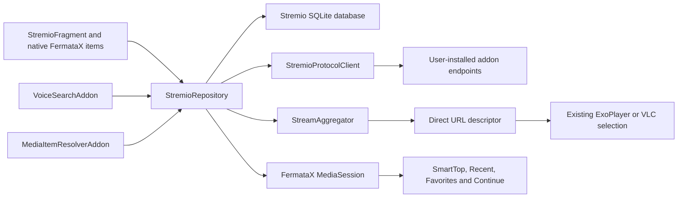

# FermataX Stremio Addon Goal and Technical Plan

> Status: SUPERSEDED. This native-addon goal is retained as historical evidence only. The current
> normative plan is [`web-only/README.md`](web-only/README.md).

Status: backend foundation implemented; active UX work moved to
`STREMIO_VIEWING_EXPERIENCE_GOAL.md`

Created: 2026-07-21

Primary product contract: `MASTER_CONTEXT.md`

Target: FermataX Android Auto, with mobile compatibility preserved

Final UI test environment: Google Desktop Head Unit (DHU), not HUR

## Current Product Direction - 2026-07-22

The protocol, repository, security and direct-playback work in this document remains the technical
foundation. Active product work is now governed by `STREMIO_VIEWING_EXPERIENCE_GOAL.md`, which
prioritizes a film-first Home, Discover, Details, Episodes, Stream Picker and Library experience.

Stremio no longer routes `ytId` into the FermataX YouTube addon. The parser recognizes `ytId` only
to keep mixed provider responses valid; those entries are discarded before playback descriptor or
UI creation. This scope rule supersedes every later `ytId` handoff requirement in this document.

## 1. Goal

Build a native, independently removable FermataX dynamic-feature addon that consumes the
Stremio Addon Protocol without embedding or cloning the Stremio application. FermataX remains
the owner of the UI, Android Auto navigation, media session, metadata, playerbar, playback,
SmartTopCard, Recent, Favorites, Continue, keyboard and voice behavior.

The addon must let a user:

- Install a Stremio provider from an HTTP(S) manifest URL or `stremio://` URL.
- Configure, enable, disable, refresh, edit and remove each installed provider.
- Browse provider catalogs, genres and pages.
- Browse provider-supplied catalogs through the film-first Home/Discover presentation; provider
  rows remain an internal compatibility model and are not part of the normal viewing flow.
- Search compatible catalogs with the existing keyboard and in-app voice system.
- Open movie and series metadata, seasons and episodes.
- Aggregate compatible streams from all enabled providers concurrently.
- Play supported direct streams through FermataX ExoPlayer or VLC.
- Ignore `ytId` choices and expose `externalUrl` as an explicit unavailable stream until a browser
  transport can pin every network request.
- Select provider-supplied and subtitle-addon subtitles.
- Resume supported finite media through the existing progress contracts.
- Restore a persisted Stremio item from SmartTopCard, Recent or Favorites after process death.

### 1.1 Measurable outcome

The core addon is complete only when all mandatory acceptance requirements `ST-ACC-001` through
`ST-ACC-024` in this document are satisfied and no release blocker remains open.

Target operational limits on a representative mid-range Android device:

- No manifest, JSON, database, hashing or network work on the main thread.
- Cached root or catalog visible within 500 ms after opening the addon.
- Uncached provider progress visible within 1 second; no blank screen while providers respond.
- Direct-stream selection starts playback within 5 seconds on a healthy test endpoint, excluding
  provider and network latency outside the app.
- Back, playerbar and navigation rail behavior matches `MASTER_CONTEXT.md` with zero addon-specific
  override of the global TV/ordinary-video rules.
- Disabling or uninstalling Stremio leaves all other addons operational and their data unchanged.

### 1.2 Non-goals for the core release

- Reimplementing the Stremio desktop, mobile or TV UI.
- Bundling community streaming providers, provider credentials or copyrighted catalogs.
- Stremio account login, cloud addon synchronization or Trakt synchronization.
- Debrid account management.
- Torrent/P2P playback in the core `stremio` module.
- IPFS, IPNS, legacy v1/v2 transport, NZB, RAR, ZIP, 7z, TGZ or TAR playback.
- Replacing FermataX ExoPlayer, VLC, Dashboard, playerbar or global navigation architecture.
- Adding Android TV-specific UI.
- Hiding unsupported streams by silently pretending that FermataX can play them.

Torrent support is an optional, separately packaged module described in section 16. It is not a
release blocker for the core Stremio addon.

## 2. Product Invariants

These rules override convenience shortcuts in later phases.

### 2.1 Behavior preservation

- Existing TV, Xtream, Radio, Podcast, Audiobook, YouTube, Web and local-media behavior must not
  change merely because Stremio is installed or enabled.
- Dashboard startup, card ordering, navigation-rail ordering and left/right rail preference remain
  unchanged.
- Existing SmartTopCard, playerbar, fullscreen, toolbar-title and Back contracts remain the source
  of truth.
- No existing public preference key, route, manifest component, provider authority, item ID or
  database schema may be renamed without a tested migration.
- No Stremio provider is allowed to mutate another addon's preferences, cache, database or files.
- Updates must preserve installed provider order, enabled state, credentials, favorites and
  progress.

### 2.2 Addon isolation

- `modules/stremio` may depend on the base `:fermata` module and shared utilities only.
- It must not have a compile-time dependency on `modules/web`, `modules/tv`, `modules/radio`,
  `modules/podcast`, `modules/audiobook`, ExoPlayer or VLC implementation classes.
- Cross-addon playback is requested through a generic capability contract owned by base code.
- The capability router considers enabled and installed addons only.
- `ytId` choices are discarded before descriptor/UI creation; `externalUrl` remains unavailable in
  the core release and neither target may break direct Stremio streams.
- Removing or disabling Stremio unregisters its root, resolver, voice target and media-session
  listener before its runtime scope is released.
- A stopped Stremio runtime cannot call a Fragment, mutate playback or apply a delayed network
  response.
- No Stremio class name or fragment ID may be added as a special case to `ControlPanelView`,
  `DashboardFragment`, `BackNavigationPolicy` or another addon.

### 2.3 Source policy

- A true fresh install may install Cinemeta once as a removable default.
- OpenSubtitles may be installed once when subtitle support is enabled.
- Default providers must respect a one-time migration marker and must never be forcibly reinstalled
  after a user removes or disables them.
- No community stream provider, torrent provider, tokenized provider or debrid configuration is
  bundled.
- FermataX displays content supplied by user-installed providers and does not host media.

## 3. Reference and License Policy

### 3.1 Primary specifications

| Reference | Use |
| --- | --- |
| [Stremio Addon Protocol](https://stremio.github.io/stremio-addon-sdk/protocol.html) | Resource paths, transport and extra arguments |
| [Manifest format](https://stremio.github.io/stremio-addon-sdk/api/responses/manifest.html) | Resources, types, `idPrefixes`, catalogs and configuration hints |
| [Resource model](https://stremio.github.io/stremio-addon-sdk/api/) | Catalog -> meta -> video -> stream/subtitle flow |
| [Stream object](https://github.com/Stremio/stremio-addon-sdk/blob/master/docs/api/responses/stream.md) | Direct URL, `ytId`, `externalUrl`, torrent and behavior hints |
| [Subtitles object](https://stremio.github.io/stremio-addon-sdk/api/responses/subtitles.html) | Subtitle response fields |
| [Deep links](https://stremio.github.io/stremio-addon-sdk/deep-links.html) | `stremio://` normalization |
| [Official addon descriptors](https://github.com/Stremio/stremio-official-addons/blob/master/index.json) | Verified default manifest descriptors |

Protocol facts must come from these sources before a third-party implementation.

### 3.2 Open-source code references

| Project | License | Code/pattern to study | FermataX rule |
| --- | --- | --- | --- |
| [stremio-addon-client](https://github.com/Stremio/stremio-addon-client) | MIT | `AddonClient.js`, `AddonCollection.js`, `stringifyRequest.js`, `isSupported.js`, `http.js` and tests | Port protocol behavior into typed Java; do not embed Node.js |
| [stremio-core](https://github.com/Stremio/stremio-core) | MIT | Immutable models, request filtering, aggregation and loadable state | Use as semantic reference; keep FermataX's media and UI ownership |
| [NuvioMobile](https://github.com/NuvioMedia/NuvioMobile) | GPL-3.0 | `AddonManifestParser.kt`, `AddonTransportUrls.kt`, repositories, stream parser/fetch support | Study Android failure handling and model normalization; record copied/adapted code provenance |
| [jlibtorrent](https://github.com/frostwire/frostwire-jlibtorrent) | MIT | Torrent session, metadata, file selection, priorities and streaming | Optional `stremio-torrent` module only |

Pinned research snapshots used when writing this plan:

- NuvioMobile commit `b1c9d08435a5b7d7487b30bbf181cb48830c2458`.
- stremio-addon-client commit `7c66830cfc1a8e749373d9df0bb105c7dad33bfd`.

Before implementation, Phase 0 records the current upstream commit and license text in a small
`docs/stremio/REFERENCES.md`. If code is adapted, the implementing commit must identify the source
file and preserve every license obligation. Do not copy a GPL implementation into a differently
licensed file without confirming repository-wide compatibility, even though FermataX is GPL-3.0.

#### Code reference map

Use this map during Phase 0 and record the exact upstream revision beside every adapted behavior.

`stremio-addon-client`:

| Upstream file | Behavior to port into tests/Java | Do not copy |
| --- | --- | --- |
| `lib/AddonClient.js` | Immutable manifest/descriptor boundary and one generic `get()` resource call | JavaScript callback/promisify layer |
| `lib/AddonCollection.js` | Descriptor-based add/remove/deduplication semantics | Mutable in-memory collection as the source of truth |
| `lib/stringifyRequest.js` | Resource/type/id/extra path construction and empty-extra omission | Node `querystring` encoding without Android Unicode tests |
| `lib/util/isSupported.js` | Catalog special case and resource/type/`idPrefixes` matching | Assumption that every manifest has a valid resources array |
| `lib/util/mapURL.js` | Recognition of transport URL forms | Blind HTTP-to-HTTPS rewrite and localhost browser assumptions |
| `lib/transports/http.js` | `/manifest.json` replacement and response cache metadata | Unbounded fetch, missing body deadline and browser CORS assumptions |
| `test/` equivalents | Edge-case fixtures and compatibility expectations | Test dependencies or runtime Node engine |

NuvioMobile pinned snapshot paths:

```text
composeApp/src/commonMain/kotlin/com/nuvio/app/features/addons/AddonManifestParser.kt
composeApp/src/commonMain/kotlin/com/nuvio/app/features/addons/AddonTransportUrls.kt
composeApp/src/commonMain/kotlin/com/nuvio/app/features/addons/AddonRepository.kt
composeApp/src/commonMain/kotlin/com/nuvio/app/features/catalog/CatalogRepository.kt
composeApp/src/commonMain/kotlin/com/nuvio/app/features/details/MetaDetailsRepository.kt
composeApp/src/commonMain/kotlin/com/nuvio/app/features/search/SearchRepository.kt
composeApp/src/commonMain/kotlin/com/nuvio/app/features/streams/StreamModels.kt
composeApp/src/commonMain/kotlin/com/nuvio/app/features/streams/StreamParser.kt
composeApp/src/commonMain/kotlin/com/nuvio/app/features/streams/StreamsRepository.kt
composeApp/src/commonMain/kotlin/com/nuvio/app/features/streams/StreamFetchSupport.kt
```

Study its typed normalization, provider repository split, stream parsing and partial-failure flow.
Do not copy Compose UI, Media3 ownership, account/cloud assumptions or its product navigation into
FermataX.

FermataX code to reuse rather than replace:

| Local file/area | Required use |
| --- | --- |
| `fermata/.../addon/VoiceSearchAddon.java` | Addon-neutral voice target and stable selection callback |
| `fermata/.../addon/MediaItemResolverAddon.java` | Persisted item reconstruction and favorite synchronization |
| `fermata/.../media/lib/PlaybackProgressItem.java` | Existing progress capability |
| `fermata/.../security/SecurePreferenceStore.java` | Base-owned encrypted secrets, avoiding duplicated crypto in a feature |
| `fermata/.../ui/fragment/DashboardPlayableNavigator.java` | SmartTop/Recent open-current navigation |
| `fermata/.../ui/policy/ItemRoutePolicy.java` | Capability-based owning destination |
| `fermata/.../ui/policy/BackNavigationPolicy.java` | Playerbar/activity Back convergence |
| `fermata/.../ui/policy/PlaybackLayoutPolicy.java` | Split/fullscreen/rail layout decisions |
| `modules/podcast` and `docs/podcast` | Dynamic-feature isolation, DB, secret, progress and acceptance-test precedent |
| `modules/audiobook` | Remote catalog/source and finite-media progress precedent |

The ellipsis in this table means the existing source root under
`fermata/src/main/java/me/aap/fermata`; implementation commits must cite the full path. Shared core
changes require a generic contract and tests from at least one existing addon plus Stremio.

### 3.3 Behavioral APK reference

The following APK was inspected only to learn observable behavior:

```text
URL: https://github.com/malebuffy/Fermata-Xtream/releases/download/v2.4.18/
     fermata-rec-2.4.18-auto-release-universal.apk
Package: me.aap.fermatamod.dear.google.why.bingo2.rec
Version: 2.4.18 (412)
SHA-256: BCA83F847F84CE577A594F92F78D96C2C8CA010AB3074E40ABB67E383F753C8E
```

Useful observed behavior:

- Native catalog, details, season and episode navigation.
- Provider filter chips on stream results.
- Configurable-provider WebView and `stremio://` interception.
- Cinemeta/OpenSubtitles defaults.
- Embedded and provider subtitle aggregation.
- Torrent metadata, file selection, piece prioritization and local HTTP Range serving.

Patterns that must not be copied:

- Full tokenized addon URLs in plain SharedPreferences or `addons.json`.
- Entire meta/stream JSON encoded into playable IDs.
- Sequential provider requests.
- Unbounded or absent catalog/meta TTL.
- Fixed four/five-column layouts.
- Episode toolbar title falling back to the series title.
- Bundled unused Stremio Web assets.
- Torrent native libraries in the core addon.

The APK is not published as reusable source. Decompiled classes are not an implementation source
and must not be copied into FermataX.

## 4. Architecture

### 4.1 System boundary



Stremio providers are data providers, not UI plugins inside FermataX. Their JSON never creates an
Android View or invokes a Fragment directly.

### 4.2 Layer rules

```text
StremioFragment / dialogs / list items
                  |
                  v
Use cases: browse, search, details, aggregate, play, configure
                  |
        +---------+----------+----------------+
        |                    |                |
        v                    v                v
StremioRepository   StremioProtocolClient  PlaybackDescriptorFactory
        |                    |                |
        v                    v                v
SQLite + secrets       bounded HTTP       base playback capabilities
```

- UI consumes immutable presentation states, not transport response classes.
- Protocol DTOs remain in `stremio.protocol.model` and are normalized before persistence.
- Database rows never expose cursors or mutable JSON objects to UI items.
- Playback items never own HTTP calls. They resolve an immutable content descriptor and ask the
  repository to refresh volatile stream choices when needed.
- Every asynchronous operation carries both an addon-scope token and a UI generation.
- Repositories return `FutureSupplier` to match FermataX; no blocking `.get()` on UI/service paths.

### 4.3 Addon contracts

`StremioAddon` should implement:

```java
MediaLibAddon
VoiceSearchAddon
MediaItemResolverAddon
FermataMediaServiceAddon
MediaSessionCallback.Listener
```

Responsibilities:

- `MediaLibAddon`: own one Stremio root for the active `DefaultMediaLib`.
- `VoiceSearchAddon`: expose target `stremio` and resolve stable voice-selection IDs.
- `MediaItemResolverAddon`: reconstruct Stremio content from stable IDs after process death.
- `FermataMediaServiceAddon`: attach/detach only the Stremio progress listener.
- `MediaSessionCallback.Listener`: mirror snapshots only when the unwrapped current item is owned by
  Stremio.

If core progress storage already fully satisfies the release requirements during Phase 0
characterization, the final two interfaces may be omitted. This decision requires tests proving
episode/movie progress, completion and process restoration; it is not a shortcut based on code
size.

#### Phase 0 progress-sufficiency decision gate

This is a binary evidence gate, not the implementation owner's opinion. The Stremio implementer
produces the report, and a maintainer/reviewer approves the result. The automated contract suite
and device evidence make the actual decision:

```text
All mandatory checks pass with the Stremio MediaSession listener disabled -> core is sufficient.
One or more mandatory checks fail                                   -> core is insufficient.
```

Run the same fixture through the common progress path first. Do not add a Stremio listener merely
to make the characterization test pass. Record item ID, playback generation, requested position,
persisted position, completion state, write count, timestamps and the thread used for each write.

Mandatory checks:

| ID | Scenario | Pass threshold |
| --- | --- | --- |
| `ST-PROG-001` | Resume lookup | `getLastPlayedPosition()` returns the durable Stremio value after item reconstruction; error <= 2 seconds |
| `ST-PROG-002` | Pause checkpoint | A pause at a known position is durable within 2 seconds; position error <= 2 seconds |
| `ST-PROG-003` | Stop/service teardown | The final committed item is durable within 2 seconds and survives service recreation |
| `ST-PROG-004` | Item switch | Switching A -> B stores A's final position and never writes that position to B |
| `ST-PROG-005` | Delayed async completion | A delayed duration/database callback from A cannot overwrite B after B owns playback |
| `ST-PROG-006` | Rapid selection characterization | 100 randomized A/B/C switches produce zero wrong-item writes and zero negative positions |
| `ST-PROG-007` | Active-play checkpoint | During ten minutes of playback, maximum durable-checkpoint gap <= 20 seconds and write rate <= 4/minute plus lifecycle flushes |
| `ST-PROG-008` | Forced process death | Killing the app without pause/stop loses no more than 20 seconds; reopening resolves the same stable item and resumes within 2 seconds of the last durable checkpoint |
| `ST-PROG-009` | Completion boundary | At `max(duration - 60 seconds, duration * 0.95) - 1 ms` the item is incomplete; at the threshold it is complete, stored position is zero and it leaves Continue |
| `ST-PROG-010` | Unknown/live duration | Unknown-duration and live items never become completed and never enter finite-media Continue |
| `ST-PROG-011` | Persistence failure | A failed/asynchronous DB write does not block the main thread, change another item or crash playback; retry does not duplicate ownership |
| `ST-PROG-012` | Disable/uninstall isolation | Stopping Stremio cancels pending writes/listeners; no callback touches its closed repository or another addon |

Required evidence:

- JVM tests with a fake clock, fake repository and controllable delayed futures.
- Integration test through `MediaSessionCallback`, not only direct calls to
  `savePlaybackProgress()`.
- Device test for pause, stop and Android process death.
- One DHU restoration run through SmartTopCard and Recent.
- Database rows before/after each transition and a log proving no main-thread writes.
- Repeat `ST-PROG-006` with 1,000 randomized switches in Phase 8 after the complete Stremio
  playback/progress implementation is integrated; the allowed wrong-item and negative-position
  count remains zero.

Current-code baseline observed when this goal was written:

- `MediaSessionCallback.persistResolvedPlaybackProgress()` already rejects a stale non-outgoing
  item and preserves a committed outgoing item; existing `PlaybackTransitionTest` is useful
  evidence for `ST-PROG-004` and `ST-PROG-005`.
- The common completion rule currently uses `duration - position <= 1,000 ms`, which does not meet
  `ST-PROG-009`.
- The common path saves on lifecycle/transition events but does not by itself prove a bounded
  periodic checkpoint during uninterrupted playback, so it does not yet meet `ST-PROG-007` or
  `ST-PROG-008`.

Therefore, the initial Phase 0 expectation is **core not sufficient as-is**. Phase 0 may overturn
that expectation only with the evidence above. The preferred correction is a generic base-owned
progress coordinator or an extended generic progress policy reused by Podcast, Audiobook and
Stremio. A Stremio-only listener is the fallback when a generic change would alter proven behavior
of existing addons. Whichever path is chosen must retain the ownership tests and avoid two writers
persisting the same item independently.

### 4.4 Generic remote playback request profile

Phase 0 confirmed that `PlayableItem.getRequestHeaders()` already exists, but it is not a complete
or safe implementation of Stremio `proxyHeaders`: ExoPlayer accepts an unrestricted map without an
origin/redirect policy, while VLC supports only a subset of headers. Introduce a base-owned
`PlaybackRequestProfile` before enabling header-bearing Stremio playback.

The immutable profile contains the target URI, opaque secret-header reference, allowed origins,
expiry, redirect policy, redacted diagnostic identity and an engine-support probe. Engines receive
resolved header values only for an accepted origin. Authorization and Cookie are stripped on every
cross-origin redirect. Unsupported profiles remain visible in the stream picker but cannot start
with silently missing headers.

### 4.5 Deferred resolver capability

Persisted Stremio items can be encountered before the dynamic feature is loaded. Add a generic
deferred-resolution path that reports `LOADING`, `DISABLED` or `FAILED` and may request delivery of
an enabled addon. It must never re-enable an addon that the user disabled. Recent/Favorites retain
the stable ID during loading and show a recoverable unavailable state on failure.

### 4.6 Generic playback progress policy

The common media session retains item/generation ownership. A base-owned policy supplies completion
threshold and checkpoint interval for finite remote items, avoiding a second independent Stremio
writer beside the Podcast/Audiobook listeners. Existing addons keep their current behavior until
they explicitly adopt the generic policy and pass their characterization tests.

### 4.7 Generic external playback capability

The base capability may remain available to other addons, but Stremio does not use it. `ytId`
choices are dropped and `externalUrl` remains unavailable.

Add a base-owned contract only if no equivalent exists after Phase 0 audit:

```java
interface ExternalPlaybackHandlerAddon extends FermataAddon {
  boolean supports(ExternalPlaybackRequest request);
  FutureSupplier<PlayableItem> resolveExternalPlayback(
      DefaultMediaLib lib, ExternalPlaybackRequest request);
}
```

`ExternalPlaybackRequest` is immutable and contains a target kind (`YOUTUBE_ID` or
`EXTERNAL_URL`), stable source item ID, target value, exact title, artwork, duration and safe
context. It contains no provider response object.

Routing rules:

- `AddonManager` considers only installed and enabled handlers.
- Selection is deterministic by declared capability and priority, never class-name matching.
- YouTube and Web implement the generic interface in their own modules.
- Stremio never imports a YouTube/Web class or fragment ID.
- No enabled handler produces an explicit unsupported-stream row with an install/enable action.
- Direct URL playback bypasses this router and uses normal FermataX playable-item behavior.

## 5. Proposed Module and Class Ownership

```text
modules/stremio/
  build.gradle
  src/main/AndroidManifest.xml
  src/debug/AndroidManifest.xml
  src/main/java/me/aap/fermata/addon/stremio/
  src/main/res/
  src/test/

modules/stremio-torrent/                 # Optional, Phase 7 only
  build.gradle
  src/main/...
```

### 5.1 Package map

| Package | Proposed classes | Ownership |
| --- | --- | --- |
| `stremio` | `StremioAddon`, `StremioRootItem`, item owner marker | Addon lifecycle and root only |
| `stremio.ui` | `StremioFragment`, `AddonSourceDialog`, `AddonConfigureFragment`, `CatalogFolder`, `MetaItem`, `SeasonFolder`, `EpisodeItem`, `StreamPicker` | Native list/dialog UI and presentation state |
| `stremio.model` | `AddonDescriptor`, `CatalogDescriptor`, `MetaDescriptor`, `VideoDescriptor`, `StreamDescriptor`, `SubtitleDescriptor` | Immutable normalized domain models |
| `stremio.protocol` | `StremioProtocolClient`, `RequestEncoder`, `ManifestValidator`, `CapabilityMatcher`, `ProtocolError` | Protocol URL construction, validation and error mapping |
| `stremio.protocol.model` | Manifest/catalog/meta/stream/subtitle DTOs | JSON boundary only |
| `stremio.data` | `StremioRepository`, `StremioDatabase`, DAOs and migrations | Transactional persistence and query limits |
| `stremio.cache` | `ResponseCache`, `CachePolicy`, `SingleFlightRegistry` | TTL, stale-while-revalidate and request deduplication |
| `stremio.net` | `StremioHttpClient`, `NetworkPolicy`, `RedirectValidator`, `HeaderPolicy` | Bounded HTTP and SSRF controls |
| `stremio.playback` | `StremioPlayableItem`, `PlaybackDescriptorFactory`, `StreamAggregator`, `StreamRankingPolicy` | Stream selection and generic handoff |
| `stremio.subtitle` | `SubtitleAggregator`, `SubtitleNormalizer`, `StremioSubtitleFile` | Subtitle discovery, sorting and engine bridge |
| `stremio.security` | `StremioCredentialStore`, `StremioUrlRedactor` | Secret references and log-safe values |

Classes may be combined when a package would contain only trivial wrappers. Ownership boundaries
may not be collapsed: transport DTOs do not become UI state, and UI classes do not perform network
or SQL work.

### 5.2 Dynamic-feature metadata

Follow the existing Podcast/Radio install-time feature pattern:

```groovy
ext.addons = [[
    name: 'stremio',
    id: 'stremio_fragment',
    icon: 'stremio',
    class: 'me.aap.fermata.addon.stremio.StremioAddon',
    fragment: true,
    capabilities: 'dashboard,navigation,stremio',
    order: <chosen after current addon order audit>
]]
```

Requirements:

- Install-time delivery for the core module.
- `dist:fusing include="true"` so universal APKs contain it.
- No module-specific copy of AndroidX Security or a media engine.
- Optional torrent delivery and fusing are configured separately.
- Fresh-install activation follows the shared addon marker policy; updates retain existing markers.

## 6. Protocol Capability Matrix

| Capability | Core release | Behavior |
| --- | --- | --- |
| HTTP(S) `/manifest.json` | Required | Validate, normalize and persist a secret-safe descriptor |
| `stremio://.../manifest.json` | Required | Convert only the scheme to HTTPS unless the deep link explicitly represents a supported route |
| Manifest string resources | Required | Apply manifest-level `types` and `idPrefixes` |
| Manifest object resources | Required | Apply resource-level `types` and `idPrefixes` |
| `catalog` | Required | Catalog root, genre/search extras and explicit pagination |
| `meta` | Required | Movie/series detail and normalized videos |
| `stream` | Required | Concurrent aggregation across compatible enabled providers |
| `subtitles` | Required | Aggregate resource subtitles and stream-embedded subtitles |
| `addon_catalog` | Deferred | Do not recursively install providers in the core release |
| `search` extra | Required | Only catalogs declaring compatible `search` extra |
| `genre` extra | Required | Options from manifest; preserve provider spelling |
| `skip` extra | Required | Explicit next-page action; no endless auto-fetch while driving |
| Additional declared extras | Partial | Render safe select options; reject unsupported required extras clearly |
| Movie | Required | Meta ID normally equals video ID when no explicit videos exist |
| Series | Required | Season and episode derived from normalized video records |
| Channel/TV/Other | Compatible best effort | Show only when a valid playable flow exists; test separately |
| Direct `url` | Required | HTTP(S), HLS and DASH through an existing engine |
| `proxyHeaders.request` | Required | Pass validated request headers through a generic playable-data-source contract |
| `proxyHeaders.response` | Deferred | Requires a controlled local proxy; do not claim support or silently misapply |
| `ytId` | Unsupported | Parse safely, then discard before descriptor/UI creation |
| `externalUrl` | Deferred for security | Visible unavailable row; WebView URL validation alone cannot prevent DNS rebinding or subresource SSRF |
| `infoHash`/`fileIdx` | Optional module | Unsupported row in core; playable through `stremio-torrent` only |
| `sources` trackers/DHT | Optional module | Explicit privacy policy and per-source filtering |
| `bingeGroup` | Deferred | Preserve in descriptor for future ranking, no automatic selection initially |
| `videoHash`/`videoSize` | Required for subtitle requests | Validate bounds and pass as protocol extras |
| Legacy `/stremio/v1` | Deferred | Reject with explicit unsupported-transport error |
| IPFS/IPNS | Deferred | Reject with explicit unsupported-transport error |

### 6.1 Request construction

Canonical path:

```text
/{resource}/{type}/{id}.json
/{resource}/{type}/{id}/{percent-encoded-extra-query}.json
```

Rules ported from the MIT client behavior:

- Encode each path component once as UTF-8.
- Sort extra keys for deterministic cache keys; do not alter server-visible value order.
- Omit the extra segment when no non-empty extra values exist.
- Match catalogs by exact `(type, catalogId)`.
- Match other resources by resource name, type and optional `idPrefixes`.
- Resource-object constraints override manifest-level constraints for that resource.
- Never append a route to a URL that does not normalize to `/manifest.json`.
- Do not blindly upgrade an explicit user-entered HTTP endpoint to HTTPS. Probe HTTPS only as a
  convenience, then require an explicit per-source cleartext confirmation if HTTPS is unavailable.

## 7. Source and Configuration UX

### 7.1 Root hierarchy

```text
Stremio Home
  Continue Watching            # only when progress exists
  Catalog shelves              # film/series posters from enabled providers
  Discover                     # type/catalog/genre filters
  Search                       # keyboard and voice
  Library                      # local unified Favorites projection
  Addons                       # source management, separate from viewing flow
    Add addon
    <Installed provider>
```

Do not add separate Dashboard cards for every provider. The Stremio addon owns one Dashboard and
navigation destination.

### 7.2 Add flow

1. User opens `Add addon`.
2. Dialog accepts HTTPS/HTTP manifest URL or `stremio://` URL.
3. Input is normalized, redacted for logs and validated before any persistence.
4. Manifest is fetched on a worker executor with timeout, size and redirect limits.
5. Confirmation shows provider name, version, types, resources, configurable state and transport
   security warning when relevant.
6. Confirm stores one descriptor transactionally and refreshes only Stremio UI.
7. Duplicate transport URL or duplicate provider identity offers update/replace, not a second
   silent row.

Errors are actionable and normalized: invalid URL, unsupported scheme, DNS, timeout, TLS,
cleartext blocked, redirect blocked, HTTP status, HTML/non-JSON response, malformed JSON, invalid
manifest, duplicate provider, secure storage unavailable and cancelled request.

### 7.3 Provider item menu

Long-press uses the established FermataX item menu:

- Enable/Disable.
- Refresh manifest.
- Configure, only when declared configurable or a configuration endpoint is detected.
- Edit manifest URL.
- Move up/Move down inside the provider list only; never in the global navigation rail.
- Remove.
- Provider information and last-refresh state.

Removing a provider removes its catalog/cache rows in one transaction. Shared content metadata,
Favorites and progress are retained only when another installed provider can still resolve the
same canonical content identity; otherwise global references degrade to an unavailable item that
can be explicitly removed. Credentials are deleted after the database transaction succeeds.

### 7.4 Configurable provider flow

- Open `<manifest-base>/configure` inside a Stremio-owned WebView screen.
- Use the existing FermataX input bridge; do not create a competing keyboard implementation.
- Intercept only a user-initiated `stremio://.../manifest.json` or allowed HTTP(S) manifest URL.
- Validate and show the configured provider before replacing the old descriptor.
- Never expose the configured/tokenized URL in toolbar title, history, logs or screenshots.
- Back exits browser fullscreen first, then WebView history, then returns to provider details.
- Closing or disabling Stremio destroys this configuration WebView and clears its cookies/cache
  according to the Stremio-owned privacy policy; it does not touch the main Web addon.

## 8. Android Auto Screen and Back Contract

### 8.1 Screen hierarchy

```text
Dashboard
  -> Stremio root
      -> catalog/search results
          -> movie details -> stream picker -> fullscreen player
          -> series details -> season -> episode -> stream picker -> fullscreen player
      -> addons -> provider details/configuration
```

UI requirements:

- Use a Stremio-owned native renderer over existing MediaLib/session items; do not embed Stremio
  Web or bypass FermataX navigation/player ownership.
- Use film-first horizontal poster shelves, adaptive Discover/Search grids, metadata details and
  compact episode/stream rows as defined by `STREMIO_VIEWING_EXPERIENCE_GOAL.md`.
- No nested decorative cards or fixed column count; spans derive from current AA content width.
- Targets are at least 48 dp on AA.
- Provider chips in the stream picker are scrollable and have a visible selected state.
- Initial stream list order does not jump under the pointer after it becomes interactive.
- Every loading state has a cancellable visible status; partial provider failure leaves successful
  results usable.

### 8.2 Back rules

- Direct-video fullscreen Back uses the common FermataX video rule and returns to the stream picker
  or the exact episode/movie list context.
- Another Back walks details -> season/catalog/search -> Stremio root -> Dashboard.
- Playerbar Back and activity Back converge on the same base policy.
- Audio Back never stops playback; it returns to the owning list with playerbar visible.
- `externalUrl` remains in the stream picker as unavailable until a pinned browser transport exists.
- Dashboard and ordinary list screens retain the navigation rail.
- True fullscreen video hides top bar and rail; controls and rail show/hide together according to
  the common fullscreen policy.
- Returning from Dashboard to Stremio must not restore a split/fullscreen state without the rail.

Characterization tests for the existing Back and fullscreen rules run before and after every phase
that touches a base capability.

## 9. Keyboard and Voice

### 9.1 Keyboard

- Reuse the existing FermataX search input path and AA text-input bridge.
- Search UI must resize/pan so results never cover the active input or keyboard.
- Search icon and voice icon keep the current top-bar hit-target rules.
- Query debounce: 350 ms.
- A new query increments a generation and cancels all previous provider requests.
- Empty query returns to the prior screen; it must not query every catalog.
- Search remains available after the first use and from the Stremio root.

### 9.2 Voice intents

Minimum supported patterns after normalization/localization:

```text
Open Stremio
Search Stremio for <title>
Play <title> in Stremio
Open Stremio movie <title>
Open Stremio series <title>
Play episode <episode> season <season> of <series>
Choose result one/two/three
Play / Pause / Next / Previous
```

Flow:

1. Voice router selects target `stremio` through `VoiceSearchAddon`.
2. Stremio searches only enabled providers with compatible searchable catalogs.
3. Normalize, deduplicate and rank results.
4. One high-confidence result opens details; it does not auto-play an unconfirmed community
   stream.
5. Multiple plausible results show at most three numbered results.
6. `VoiceSession` stores stable result IDs, never raw provider JSON or URLs.
7. `Choose result N` calls `resolveVoiceSelection()` and opens the selected immutable item.
8. Media commands target the existing active media session/SmartTopCard, independent of which
   Fragment is visible.

Language comes from FermataX voice-language settings, not device location. Title matching uses
Unicode normalization and locale-aware case folding without translating provider titles.

## 10. FermataX Platform Integration

### 10.1 SmartTopCard and toolbar

- Current movie/episode title is the exact normalized playback title.
- Series name belongs in subtitle/album context; it never replaces episode title.
- Provider name and raw URL never become the primary title.
- Tapping the active direct Stremio item opens its current fullscreen/player destination.
- Tapping a paused/resumable item opens its details/list context before resuming when user choice
  is required.
- Previous/next exist only when a deterministic ordered episode queue exists.
- Favorite appears only for content items that implement the favorite contract.

### 10.2 Recent and Favorites

- Recent stores a stable content/video ID, not a stream URL.
- Reopening Recent re-resolves metadata and obtains fresh stream choices when the old stream cache
  is expired.
- A stale/deleted provider cannot make Dashboard crash; the item shows unavailable with a removal
  action.
- Favorites use canonical content identity. Provider-specific stream rows are not favorites.
- Removing a provider does not remove a favorite that another provider can resolve.
- Recent remains bounded by the existing global policy; the addon does not create a second global
  history implementation.

### 10.3 Progress and Continue

- Finite movies and episodes implement `PlaybackProgressItem`.
- Live/channel streams do not create Continue entries.
- Position snapshots are accepted only when item identity and playback generation both match.
- Item change flushes the old item before the new item becomes snapshot owner.
- Progress is coalesced to at most one database write per 15 seconds while playing, plus pause,
  stop, item change and service teardown.
- Completion threshold is `max(duration - 60 seconds, duration * 0.95)` for known duration.
- Completed items leave Continue but remain eligible for Recent.
- Stream URLs, cookies and authorization headers are never persisted in progress rows.

## 11. Stable IDs and Immutable Descriptors

### 11.1 Principles

- IDs are opaque, deterministic, URL-safe and resolvable from the Stremio database.
- No ID contains a raw manifest URL, provider token, metadata JSON, stream JSON or HTTP header.
- Provider response mutation never mutates an item currently owned by MediaSession.
- Volatile stream selection is separate from durable content identity.
- Collision detection rejects conflicting identities rather than overwriting an existing row.

### 11.2 Key derivation

```text
source_uuid           = random UUID generated once when the source is first installed
transport_fingerprint = base64url(SHA-256(normalized secret-aware transport identity))
identity_scope        = recognized canonical namespace, otherwise source_uuid
meta_key              = base64url(first 192 bits SHA-256(identity_scope + U+001F + type +
                        U+001F + provider meta id))
video_key             = base64url(first 192 bits SHA-256(meta_key + U+001F + video id))
stream_key            = base64url(first 192 bits SHA-256(source_uuid + target kind +
                        safe target identity)))
```

`source_uuid` is immutable across URL, token, manifest-version and configuration edits. The
transport fingerprint is updated only for duplicate detection; it is never a durable item key.
The secret-aware transport identity is hashed before persistence. The database stores the hash and
a redacted transport URL; the original tokenized URL is referenced from encrypted storage.

Only explicitly recognized global namespaces, such as a validated IMDb identity, may share a
canonical `identity_scope` across providers. Every custom/provider-local ID is scoped by
`source_uuid`, preventing unrelated providers that both use IDs such as `movie:1` from being merged.

Stable IDs:

```text
Stremio
stremio:section:<section>
stremio:addon:<source_uuid>
stremio:catalog:<source_uuid>:<type>:<catalog_key>
stremio:meta:<type>:<meta_key>
stremio:video:<type>:<video_key>
stremio:voice:<session_generation>:<rank>
```

Pagination/query state is transient and is not embedded in a durable item ID.

### 11.3 Immutable playback descriptor

`StremioPlaybackDescriptor` contains:

```text
schemaVersion
stableVideoId
contentType
metaId and videoId (encrypted reference if secret-bearing)
title
seriesTitle
seasonNumber and episodeNumber
posterUrl/artwork key
durationMs
releaseInfo
canonical content identity
createdAtMs and metadataUpdatedAtMs
```

It does not contain a selected provider response, mutable DTO, full JSON, cookies, authorization
headers or an unbounded list of streams. A `StremioPlayableItem` captures one descriptor instance.
Changing episode or selected content creates a new item instance and one media-session generation.

`StreamDescriptor` is a short-lived immutable value with target kind, provider key, display label,
quality hints, validated request-header references, subtitles and expiry. It is cached separately
and re-fetched when expired.

## 12. Persistence and Credential Storage

Use a dedicated `files/stremio/stremio.db` through the existing asynchronous SQLite wrapper. UI and
service code never opens the database synchronously on the main thread.

### 12.1 Schema version 1

```sql
CREATE TABLE stremio_meta_state (
  key TEXT PRIMARY KEY,
  value TEXT NOT NULL
);

CREATE TABLE stremio_addon (
  source_uuid TEXT PRIMARY KEY,
  transport_fingerprint TEXT NOT NULL UNIQUE,
  addon_id TEXT NOT NULL,
  name TEXT NOT NULL,
  version TEXT NOT NULL DEFAULT '',
  redacted_transport_url TEXT NOT NULL,
  secret_ref TEXT,
  enabled INTEGER NOT NULL DEFAULT 1,
  position INTEGER NOT NULL,
  manifest_json TEXT NOT NULL,
  manifest_etag TEXT,
  manifest_last_modified TEXT,
  last_checked_ms INTEGER NOT NULL DEFAULT 0,
  last_success_ms INTEGER NOT NULL DEFAULT 0,
  last_error_code TEXT,
  installed_ms INTEGER NOT NULL,
  updated_ms INTEGER NOT NULL
);

CREATE TABLE stremio_meta (
  meta_key TEXT PRIMARY KEY,
  identity_scope TEXT NOT NULL,
  type TEXT NOT NULL,
  provider_meta_id TEXT NOT NULL,
  canonical_identity TEXT,
  name TEXT NOT NULL,
  description TEXT NOT NULL DEFAULT '',
  poster_url TEXT,
  background_url TEXT,
  logo_url TEXT,
  release_info TEXT,
  runtime_ms INTEGER NOT NULL DEFAULT -1,
  genres_json TEXT NOT NULL DEFAULT '[]',
  updated_ms INTEGER NOT NULL,
  UNIQUE(identity_scope, type, provider_meta_id)
);

CREATE TABLE stremio_meta_provider (
  meta_key TEXT NOT NULL,
  source_uuid TEXT NOT NULL,
  provider_meta_id TEXT NOT NULL,
  priority INTEGER NOT NULL DEFAULT 0,
  updated_ms INTEGER NOT NULL,
  PRIMARY KEY(meta_key, source_uuid),
  FOREIGN KEY(meta_key) REFERENCES stremio_meta(meta_key) ON DELETE CASCADE,
  FOREIGN KEY(source_uuid) REFERENCES stremio_addon(source_uuid) ON DELETE CASCADE
);

CREATE TABLE stremio_video (
  video_key TEXT PRIMARY KEY,
  meta_key TEXT NOT NULL,
  type TEXT NOT NULL,
  provider_video_id TEXT NOT NULL,
  title TEXT NOT NULL,
  season_no INTEGER,
  episode_no INTEGER,
  released_ms INTEGER NOT NULL DEFAULT 0,
  duration_ms INTEGER NOT NULL DEFAULT -1,
  thumbnail_url TEXT,
  updated_ms INTEGER NOT NULL,
  UNIQUE(meta_key, provider_video_id),
  FOREIGN KEY(meta_key) REFERENCES stremio_meta(meta_key) ON DELETE CASCADE
);

CREATE TABLE stremio_progress (
  video_key TEXT PRIMARY KEY,
  position_ms INTEGER NOT NULL DEFAULT 0,
  duration_ms INTEGER NOT NULL DEFAULT -1,
  completed INTEGER NOT NULL DEFAULT 0,
  last_played_ms INTEGER NOT NULL DEFAULT 0,
  updated_ms INTEGER NOT NULL,
  FOREIGN KEY(video_key) REFERENCES stremio_video(video_key) ON DELETE CASCADE
);

CREATE TABLE stremio_response_cache (
  cache_key TEXT PRIMARY KEY,
  source_uuid TEXT NOT NULL,
  resource TEXT NOT NULL,
  payload BLOB NOT NULL,
  etag TEXT,
  last_modified TEXT,
  stored_ms INTEGER NOT NULL,
  fresh_until_ms INTEGER NOT NULL,
  stale_until_ms INTEGER NOT NULL,
  FOREIGN KEY(source_uuid) REFERENCES stremio_addon(source_uuid) ON DELETE CASCADE
);

CREATE INDEX stremio_addon_position ON stremio_addon(enabled, position);
CREATE INDEX stremio_meta_identity ON stremio_meta(identity_scope, type, canonical_identity);
CREATE INDEX stremio_video_series ON stremio_video(meta_key, season_no, episode_no);
CREATE INDEX stremio_progress_continue ON stremio_progress(completed, last_played_ms DESC);
CREATE INDEX stremio_cache_expiry ON stremio_response_cache(stale_until_ms);
```

Catalog pages do not need a permanent normalized table in version 1. Their bounded response cache
maps previews to normalized `stremio_meta` rows transactionally.

### 12.2 Migration rules

- Read `stremio_meta_state.schema_version` before every DAO becomes available.
- Run each migration in one transaction and update schema version last.
- Test upgrade from every shipped schema fixture.
- Never use destructive migration in release builds.
- On migration failure, retain the previous database and disable only Stremio with a recoverable
  diagnostic.
- Removing the dynamic feature does not delete its database; explicit `Clear Stremio data` does.

### 12.3 Secret storage

Use `SecurePreferenceStore.open(context, "stremio_credentials")` from the base module.

Encrypted values may contain:

- Original manifest URL when it contains user-info or sensitive query/path tokens.
- Configured provider URL.
- Provider-supplied request headers that contain Cookie or Authorization values.
- Secret-bearing meta/video IDs only when unavoidable.

SQLite stores opaque secret references and redacted display values. If encrypted storage cannot be
opened, public providers continue to work; adding a secret-bearing provider fails with
`SECURE_STORAGE_UNAVAILABLE`. Never fall back to plain preferences.

## 13. Request, Concurrency, Cancellation and Cache Policy

### 13.1 HTTP limits

| Resource | Maximum body | Fresh TTL | Stale fallback |
| --- | ---: | ---: | ---: |
| Manifest | 512 KiB | 24 hours | 7 days |
| Catalog/search | 4 MiB | 15 minutes | 24 hours |
| Meta | 4 MiB | 6 hours | 7 days |
| Stream | 2 MiB | 2 minutes | None for credentialed URLs; 5 minutes for public URLs |
| Subtitles response | 2 MiB | 10 minutes | 1 hour |
| Subtitle file | 10 MiB | Existing file-cache policy | Existing file-cache policy |

Network defaults:

- DNS/connect timeout: 5 seconds.
- Response-header timeout: 8 seconds.
- Whole JSON request deadline: 12 seconds.
- Redirect maximum: 5, validating every hop.
- Global Stremio JSON concurrency: 8.
- Per-host concurrency: 4.
- Concurrent stream/subtitle providers for one selection: 4, queueing the remainder.
- Retry: one retry for idempotent timeout/connection reset/502/503/504 with jitter; no automatic
  retry for 4xx, malformed JSON, cancellation or blocked policy.

Values are constants covered by tests, then tunable only from measured evidence.

### 13.2 Single-flight and generations

- Requests with the same canonical cache key share one in-flight future.
- Each Fragment load has a monotonically increasing view generation.
- Each search query has a search generation.
- Each playback selection has a playback generation.
- Applying a result requires both an active addon scope and matching generation.
- `stop()`, provider disable/remove, Fragment destroy and new query cancel owned futures.
- Cancellation closes response bodies and temporary files.
- A provider completion after cancellation may update a valid cache but cannot update UI or start
  playback.

### 13.3 Aggregation policy

- Determine compatible providers using exact resource/type/`idPrefixes` matching before network.
- Start up to four provider requests concurrently.
- Deduplicate streams by normalized target identity plus effective headers, not display title.
- Rank direct HTTPS/HLS/DASH first, then direct HTTP with warning, then supported external targets,
  then optional torrent; unsupported targets remain visible at the end.
- Initial interactive list settles after all providers complete or 2.5 seconds, whichever comes
  first.
- Late successful results append in one batch and never reorder rows already under user focus.
- Provider filter chips expose `All` and only providers with accepted results.
- One provider failure is displayed in provider status but does not fail the entire screen.
- All-provider failure shows a normalized aggregate error and retry action.

### 13.4 Cache rules

- Honor valid `Cache-Control`, ETag and Last-Modified while enforcing the local maximum TTL.
- Serve fresh cache immediately.
- Serve stale catalog/meta immediately during refresh when allowed, with a subtle refreshing state.
- Never persist unredacted request URLs as cache keys; use a keyed digest over canonical identity.
- Never persist Authorization/Cookie headers in response payloads.
- LRU budget for JSON response cache: 50 MiB by default, with per-provider and per-resource caps.
- Cleanup runs on the addon worker, not app startup main thread.
- Manifest refresh that changes capabilities invalidates only incompatible cache entries.

## 14. Playback and Subtitle Architecture

### 14.1 Direct streams

`StremioPlayableItem.getLocation()` resolves a short-lived selected direct target. Engine selection
remains in FermataX. The addon provides:

- Validated URL.
- MIME/container hints when available.
- Immutable exact title/artwork/duration.
- Safe request-header map through a generic core data-source contract.
- Optional subtitle descriptors.

The core header contract must be implemented by both ExoPlayer and VLC adapters or the stream must
be marked unsupported. Do not place header values into a URL query string. Range remains engine
owned; provider-supplied `Host`, `Connection`, `Content-Length`, `Transfer-Encoding` and `Range`
headers are rejected.

### 14.2 Unsupported `ytId` and `externalUrl`

- Parse `ytId` without invalidating healthy direct choices from the same provider, then discard it
  before descriptor/UI creation.
- Treat `externalUrl` as unsupported in core. Validating main-frame URLs before WebView navigation
  is insufficient because WebView performs independent DNS, subresource, service-worker and
  WebSocket requests. Re-enable only with an end-to-end pinned transport.

### 14.3 Subtitle aggregation

Sources:

1. `stream.subtitles` embedded in the selected stream descriptor.
2. Every enabled compatible provider declaring the `subtitles` resource.
3. Existing embedded media subtitle tracks reported by the active engine.

Policy:

- Request subtitle providers concurrently with a maximum of four.
- Pass validated `videoHash` and `videoSize` when available.
- Normalize BCP-47/ISO language tags without changing the displayed provider label.
- Deduplicate by normalized final URL, language and optional subtitle ID.
- Rank exact configured language, base-language match, unknown language, then others.
- Prefer non-hearing-impaired only when the provider exposes the distinction and user preference
  requests it.
- Support only formats already accepted by FermataX subtitle parsing in the core release.
- Validate redirect, content type and 10 MiB body limit before handing a file to the engine.
- Subtitle failure never stops video playback.
- Subtitle URLs and tokens are redacted in logs and never used as stable IDs.

## 15. Security Contract

### 15.1 URL and SSRF policy

- Accept only `https`, explicitly confirmed `http`, and normalized `stremio` manifest inputs.
- Reject `file`, `content`, `javascript`, `data`, `intent`, `ftp`, custom schemes and malformed URLs.
- Resolve DNS and reject loopback, link-local, multicast, unspecified and private ranges by default.
- A per-provider `Allow local network` option may permit private LAN targets after an explicit
  warning; loopback remains unavailable unless a future local-addon design owns it.
- Validate every redirect target and re-resolve DNS to reduce rebinding risk.
- Reject URL user-info from display and logs; store it only through encrypted references.
- Configuration WebView allows navigation only within its source origin plus a user-initiated final
  manifest URL.
- No Stremio endpoint is exposed through an exported ContentProvider, Activity or local open proxy.

### 15.2 Header policy

- Request-header allowlist: `User-Agent`, `Referer`, `Origin`, `Cookie`, `Authorization`, `Accept`
  and `Accept-Language`.
- Limit header count to 16, name to 64 bytes and value to 8 KiB.
- Strip control characters and reject duplicate security-sensitive headers.
- Never forward provider headers to a different origin after redirect unless the policy explicitly
  allows safe `Referer`/`Origin`; strip Authorization and Cookie cross-origin.
- Never log full header maps.
- Response-header rewriting is unsupported until a separately audited bounded local proxy exists.

### 15.3 Data and privacy

- Redact tokens in exceptions, analytics, screenshots, item subtitles and toolbar titles.
- Disable WebView password saving and file/content access in provider configuration.
- Clear configuration WebView state when its provider is removed.
- No provider may read another provider's encrypted values.
- No default community provider or tracking endpoint.
- Add a legal note that the user is responsible for sources and content access rights.

## 16. Optional Torrent Module

`modules/stremio-torrent` is a separate dynamic feature and may be excluded from the Play build.

### 16.1 Boundary

- Implements a generic `StremioStreamTargetHandler` for `infoHash`/`fileIdx`.
- Depends on a base/library-owned stream-target contract and jlibtorrent. One dynamic feature must
  not depend directly on another dynamic feature.
- Core Stremio remains fully functional when the module is absent, disabled or fails to load.
- User must explicitly enable P2P and acknowledge network, battery, storage, privacy and legal
  implications.

### 16.2 Required torrent behavior

- Validate 40-character hex or 32-character base32 info hash.
- Fetch metadata with deadline and cancellation.
- Select explicit `fileIdx`; otherwise show a file picker filtered to supported media extensions.
- Never silently select largest file when multiple plausible episodes exist.
- Prioritize initial and seek-adjacent pieces.
- Serve playback through a loopback-only HTTP Range server with an unguessable per-session token.
- Bind only to `127.0.0.1`, reject non-loopback callers and close on stop/disable.
- Apply storage quota, cleanup and low-space policy.
- Stop seeding after playback according to an explicit user setting; default is no background
  seeding.
- Package only required ABIs and report the APK/AAB size delta before release.
- Before creating `modules/stremio-torrent`, add an explicit Gradle inclusion flag. The repository
  currently auto-includes every directory under `modules`, so merely omitting it from a dependency
  list is not enough to exclude it from the Play build.

### 16.3 Torrent release gates

- Native crash and ABI tests on arm64-v8a, armeabi-v7a and x86_64 where packaged.
- Range, seek, cancellation, multi-file and low-space tests.
- Battery/network behavior measured during 30-minute playback.
- Legal/product approval independent from the core addon.

## 17. Phased Implementation Plan

No phase starts until the previous phase exit gate passes. Each phase is one reviewable commit or a
small ordered series of atomic commits. Do not mix unrelated cleanup.

### Phase 0 - Baseline, contracts and fixtures

Objective: freeze current behavior and protocol inputs before production code.

- [ ] Record current git revision, dirty-worktree backup and build commands.
- [ ] Read and link `MASTER_CONTEXT.md`, Podcast architecture and current addon lifecycle.
- [ ] Characterize `AddonManager`, `ItemRoutePolicy`, `DashboardPlayableNavigator`,
  `BackNavigationPolicy`, `PlaybackLayoutPolicy`, progress and subtitle contracts.
- [ ] Confirm whether a generic request-header playable contract already exists.
- [ ] Confirm whether base progress persistence alone satisfies Stremio Continue requirements.
- [ ] Pin upstream reference commits and licenses in `docs/stremio/REFERENCES.md`.
- [ ] Add protocol fixtures for minimal manifest, object resources, catalogs, meta, series videos,
  direct streams, proxy headers, YouTube/external streams, subtitles, malformed JSON, HTML auth
  failure, large payload, slow body and redirects.
- [ ] Add characterization tests for Dashboard, SmartTop, playerbar, Back, enabled-addon routing and
  current cold start.
- [ ] Produce a dependency and size baseline for universal APK and AAB.

Exit gate:

- Baseline build and existing tests pass.
- Fixtures contain no real credentials or copyrighted provider configuration.
- Every proposed base-code change has a failing characterization/contract test first.

Rollback point: documentation and test fixtures only.

### Phase 1 - Generic contracts and isolated module shell

Objective: install, disable and remove an empty Stremio root without affecting another addon.

- [ ] Add and characterize generic deferred resolver, external playback target,
  `PlaybackRequestProfile`, progress policy and remote subtitle contracts before Stremio uses them.
- [ ] Preserve existing addon behavior by leaving new contracts opt-in.
- [ ] Create `modules/stremio` with install-time delivery and universal fusing.
- [ ] Register `AddonCapability.STREMIO` and metadata through the existing generic registry.
- [ ] Implement `StremioAddon`, runtime scope, root and empty native Fragment.
- [ ] Add translated strings to every currently supported locale, using English fallback where a
  verified translation is unavailable.

Exit gate:

- Stremio appears once on fresh install and follows Dashboard/nav ordering.
- Disabling/removing Stremio leaves every other addon visible and functional.
- Deferred IDs report loading/disabled/failed without enabling a user-disabled addon.
- Module shell performs no database or HTTP work.

Rollback point: remove module registration and base capability enum/resource additions; no other
addon data migration is involved.

### Phase 2 - Security-first protocol, persistence and source management

Objective: make all supported provider requests correct, bounded and testable without UI.

- [ ] Implement typed DTO parsing with unknown-field tolerance and required-field validation.
- [ ] Implement request encoder and exact capability matcher.
- [ ] Implement bounded HTTP, redirects, SSRF policy, header redaction and error mapping.
- [ ] Pin validated DNS results to the actual connection and cover IPv4-mapped IPv6, ULA,
  link-local, metadata endpoints and rebinding.
- [ ] Implement single-flight, generations, cancellation and response cache.
- [ ] Implement database version 1 on a worker executor; enable and verify foreign keys.
- [ ] Drain/cancel queued database work before closing the repository.
- [ ] Implement encrypted credential namespace and secret-taint scanning before arbitrary JSON or
  cache payloads are persisted.
- [ ] Implement source URL normalization, redaction and add/edit/enable/disable/refresh/remove.
- [ ] Keep immutable `source_uuid` across URL/token edits and use transport fingerprint only for
  duplicate detection.
- [ ] Implement fresh-install Cinemeta marker, removable default and provider-order persistence.
- [ ] Normalize addon, catalog, meta and video descriptors transactionally.
- [ ] Implement conditional requests and stale-while-revalidate.
- [ ] Add collision, duplicate-provider and migration tests.
- [ ] Add MockWebServer-style tests for timeout, stalled body, redirect, HTML response, malformed
  payload, limits, cancellation and cache revalidation.

Exit gate:

- Protocol fixture matrix passes.
- No network/database work occurs on main thread under StrictMode test.
- Disabled provider is never selected by capability matching.
- Cache and cancellation tests show no stale UI callback or playback side effect.
- Update/fresh-install activation tests pass.
- Editing URL/token preserves `source_uuid`, Favorite, Recent and progress references.
- No secret appears in database, prefs dump, cache, logs or UI.

Rollback point: Phase 1 provider list remains; protocol browsing stays hidden behind a feature flag.

### Phase 3 - Catalog, search and details UI

Objective: complete native browsing through movie/series/season/episode without playback.

- [ ] Render provider catalogs with responsive FermataX list/card components.
- [ ] Implement genre and explicit `skip` pagination.
- [ ] Implement metadata detail, movie and series video normalization.
- [ ] Group seasons deterministically and sort numeric episodes safely.
- [ ] Implement keyboard search with debounce/generation cancellation.
- [ ] Aggregate and deduplicate search results across compatible enabled providers.
- [ ] Implement loading, empty, partial failure, stale and retry states.
- [ ] Preserve exact title/subtitle context in toolbar navigation.
- [ ] Test compact/wide AA dimensions and mobile rotation/recreation.

Exit gate:

- Catalog -> details -> season -> episode works on mobile and DHU.
- Search keyboard remains usable and not covered.
- Back returns through the exact hierarchy to Dashboard.
- Cached screen appears within the target and provider failure does not blank successful results.

Rollback point: hide catalog entry while provider management remains available.

### Phase 4 - Stream aggregation and direct playback

Objective: play direct streams through existing FermataX engines with correct ownership.

- [ ] Implement concurrent `StreamAggregator` and stable provider chips.
- [ ] Implement immutable playback and short-lived stream descriptors.
- [ ] Implement direct HTTP(S), HLS and DASH handoff.
- [ ] Add generic request-header data-source capability to base/engines if Phase 0 found none.
- [ ] Drop `ytId` choices and implement explicit unavailable `externalUrl` rows.
- [ ] Implement exact media-session title, artwork, duration and source ownership transfer.
- [ ] Implement unsupported target rows for torrent/archives/legacy transports.
- [ ] Re-fetch expired stream choices from Recent instead of replaying stale URLs.
- [ ] Test provider switch, addon switch, engine switch and failed handoff rollback.

Exit gate:

- Healthy direct fixtures play through ExoPlayer and VLC where each engine supports the format.
- Switching TV/Radio/Stremio transfers audio, video, metadata and toolbar ownership together.
- Fullscreen/playerbar Back passes existing and Stremio tests on DHU.
- One failed stream provider does not prevent another result from playing.

Rollback point: disable Stremio playback capability while retaining browse-only behavior.

### Phase 5 - SmartTop, Recent, Favorites, Continue and voice

Objective: integrate with FermataX's unified surfaces without introducing parallel state.

- [ ] Implement `MediaItemResolverAddon` using stable DB-backed IDs.
- [ ] Implement Favorites callback and canonical content identity.
- [ ] Implement finite-item progress and completion policy.
- [ ] Verify media-session generation before every progress write.
- [ ] Implement SmartTop open-current and back-to-list destinations.
- [ ] Implement previous/next only for deterministic episode queues.
- [ ] Implement Stremio voice target, search and three-result selection.
- [ ] Test process death, provider removal, disabled handler and unavailable item behavior.

Exit gate:

- SmartTop, Recent and Favorites reopen the same content after process restart.
- Top bar and SmartTop show exact movie/episode title, never URL/provider ID.
- Progress never moves from one episode to another during skip or rapid selection.
- Voice finds newly installed providers without app restart and numbered selection is stable.

Rollback point: unregister resolver/voice/progress listeners; browsing and direct playback remain.

### Phase 6 - Configuration and subtitles

Objective: support configurable providers and complete subtitle selection safely.

- [ ] Build isolated configuration WebView and final manifest interception.
- [ ] Verify keyboard behavior on mobile and DHU.
- [ ] Install OpenSubtitles once when enabled, respecting removal marker.
- [ ] Aggregate stream-embedded and provider subtitles.
- [ ] Implement language normalization, ranking, deduplication and bounded file retrieval.
- [ ] Test tokenized configured URLs for redaction and encrypted persistence.
- [ ] Test subtitle failure, delayed response, unsupported format and provider removal.

Exit gate:

- Configured provider can be installed without exposing its URL/token.
- Subtitle list is stable, language-ranked and does not block playback.
- Configuration WebView cannot navigate to file/content/custom schemes or leak into Web addon state.

Rollback point: disable configure/subtitle feature flags; core provider and playback state remain.

### Phase 7 - Optional torrent feature

Objective: add P2P only as an independently removable capability.

- [ ] Create `modules/stremio-torrent` and public target-handler interface.
- [ ] Integrate pinned jlibtorrent version with license notices.
- [ ] Implement explicit consent, session lifecycle, metadata and file picker.
- [ ] Implement piece priority and loopback Range server.
- [ ] Implement storage quota, cleanup, network and seeding policy.
- [ ] Measure native size per ABI and runtime memory/battery.
- [ ] Run all torrent-specific security and device tests.

Exit gate:

- Removing torrent module leaves direct Stremio playback unchanged.
- No open LAN server, lingering session, background seeding or unbounded storage remains.
- Product/legal approval is recorded.

Rollback point: remove optional module from packaging; no core schema downgrade is required.

### Phase 8 - Hardening, release and documentation

Objective: prove release readiness and create reproducible operational evidence.

- [ ] Run full unit, integration, lintVital, R8, universal APK and AAB builds.
- [ ] Run mobile smoke tests on supported Android versions.
- [ ] Run the complete DHU matrix in section 18.
- [ ] Repeat the completed progress implementation stress test with 100 randomized A/B/C item
  switches; require zero wrong-item writes and zero negative positions.
- [ ] Test fresh install, update, disable/re-enable, uninstall/reinstall and process death.
- [ ] Run StrictMode, LeakCanary/manual heap, network cancellation and 30-minute soak tests.
- [ ] Verify no secrets with source scan, logs, database dump and APK inspection.
- [ ] Record APK/AAB/module size changes and startup timing against Phase 0.
- [ ] Update `MASTER_CONTEXT.md`, README, About/legal notices and release notes.
- [ ] Produce `docs/stremio/ACCEPTANCE_REPORT.md` mapping every requirement to evidence.

Exit gate: Definition of Done in section 21 is fully satisfied.

## 18. Test Plan

### 18.1 Automated test suites

| Suite | Mandatory cases |
| --- | --- |
| `ManifestValidatorTest` | String/object resources, required fields, extras, configurable hints, duplicate catalogs, malformed/oversize/HTML |
| `RequestEncoderTest` | Unicode, reserved characters, no double encoding, deterministic extras, empty extras |
| `CapabilityMatcherTest` | Types, resource-level override, `idPrefixes`, catalog special case, disabled providers |
| `NetworkPolicyTest` | Scheme, DNS/private/loopback, redirects, rebinding, cleartext consent, cross-origin secrets |
| `StremioHttpClientTest` | Deadlines, slow body, cancellation, retry, body close and size limits |
| `ResponseCacheTest` | Fresh/stale/expired, ETag, single-flight, LRU, secret-safe key |
| `StremioDatabaseTest` | Transactions, migrations, collision, cascade, ordering and query limits |
| `StreamAggregatorTest` | Concurrency cap, partial failure, dedupe, ranking, late results and cancellation |
| `PlaybackDescriptorTest` | Immutability, exact title, no JSON/token, movie/episode identity |
| `ProgressOwnershipTest` | Rapid item change, skip, pause, completion and process restore |
| `SubtitleAggregatorTest` | Embedded/provider merge, language, dedupe, limits and failure isolation |
| `ExternalPlaybackRouterTest` | Enabled handlers only, deterministic route, missing module and rollback |
| `StremioAddonLifecycleTest` | Start/stop/re-enable/uninstall, listener removal and late callbacks |
| `StremioVoiceTest` | Locale, new provider, three results, generation and stable selection |
| Existing regression suites | Dashboard, SmartTop, Back, fullscreen, playerbar, YouTube ownership, TV/Radio source flow |

Tests use local fixtures or a loopback test server only. No public community provider is a build
gate.

### 18.2 Build commands

Discover exact task names after module creation, then keep the verified commands in the acceptance
report. Expected Windows commands:

```powershell
.\gradlew.bat :stremio:testAutoDebugUnitTest
.\gradlew.bat :fermata:testAutoDebugUnitTest
.\gradlew.bat :fermata:lintVitalAutoRelease
.\gradlew.bat :fermata:assembleAutoRelease
.\gradlew.bat :fermata:bundleAutoRelease
.\gradlew.bat :fermata:packageAutoReleaseUniversalApk
```

Release builds require the existing approved local signing configuration. Do not commit keystore
paths or passwords.

### 18.3 Mobile device matrix

- Fresh install: default marker, provider add, catalog, search, playback, subtitles.
- Update install: preserve addon/provider enabled state, order, favorites and progress.
- Rotation/recreation during catalog, details, stream loading and playback.
- Background/foreground during direct and external playback.
- Process kill while paused; reopen through SmartTop and Recent.
- Disable Stremio while another addon plays and while Stremio plays.
- Use a mixed direct/`ytId` response; verify direct streams remain and `ytId` is absent.
- Network offline, captive HTML page, DNS failure, TLS failure, timeout and recovery.
- Long title, RTL title, CJK title and missing artwork.

### 18.4 DHU startup commands

Use the real Auto release package identity that Android Auto recognizes; a debug suffix is not a
substitute for final DHU validation.

```powershell
adb devices
adb forward tcp:5277 tcp:5277
& "$env:LOCALAPPDATA\Android\Sdk\extras\google\auto\desktop-head-unit.exe"
```

If DHU reports `wait for phone`, verify Head Unit Server is started on the phone, repeat the ADB
forward and inspect `adb devices` before changing app code.

### 18.5 DHU manual scripts

`DHU-01 Fresh root and rail`

1. Open FermataX directly from Android Auto.
2. Confirm Dashboard loads without opening Media Service first.
3. Open Stremio; rail remains visible and scroll behavior is unchanged.
4. Return Dashboard; card dimensions and SmartTop layout remain correct.

`DHU-02 Browse and Back`

1. Open catalog -> series -> season -> episode -> stream picker.
2. Back repeatedly.
3. Confirm exact parent sequence, then Stremio root, then Dashboard.
4. Confirm no stale YouTube/TV title remains in top bar.

`DHU-03 Direct video`

1. Start a direct test video.
2. Confirm exact title, artwork, duration and playerbar.
3. Enter fullscreen; rail/top bar hide.
4. Tap surface; controls and rail show then auto-hide together.
5. Playerbar Back returns to the exact stream/episode context.

`DHU-04 Cross-addon ownership`

1. Play TV, then Stremio direct video, then Radio, then another Stremio direct video.
2. At every transition verify picture, audio, MediaSession, top bar and SmartTop belong to one item.
3. Back follows the current owning addon and never an older split view.

`DHU-05 Search and voice`

1. Open Stremio search and enter text with the AA keyboard.
2. Verify input remains visible and results update after debounce.
3. Use voice search with an ambiguous title.
4. Choose result one/two/three by voice and verify stable selection.

`DHU-06 Restore`

1. Play an episode beyond two minutes and pause.
2. Leave FermataX, kill process, reopen.
3. Tap SmartTop/Recent and verify same episode, exact title and progress.
4. Remove the provider and confirm the stale item is handled without crash or token exposure.

`DHU-07 Failure isolation`

1. Enable one healthy and one failing fixture provider.
2. Confirm healthy catalogs/streams remain usable.
3. Disable Stremio and open every other enabled addon.
4. Re-enable Stremio and confirm no app restart is required.

### 18.6 Runtime evidence

Capture for the acceptance report:

- Test task output and release build hashes.
- DHU screenshots for root, details, stream picker, fullscreen and restoration.
- `adb logcat` excerpts with tokens redacted.
- StrictMode and main-thread timing evidence.
- Heap before/after repeated addon open/close.
- Network request count proving single-flight and concurrency limits.
- Universal APK and AAB size comparison.

## 19. Acceptance Traceability

| ID | Requirement | Primary phase | Required evidence |
| --- | --- | ---: | --- |
| `ST-ACC-001` | Dynamic feature is fused into universal APK and available in AAB | 1 | APK/AAB inspection |
| `ST-ACC-002` | Stremio can be disabled/removed without affecting other addons | 1 | Lifecycle tests + DHU-07 |
| `ST-ACC-003` | Fresh/update markers preserve user choices | 1 | Migration tests + device install |
| `ST-ACC-004` | Secrets are encrypted and redacted | 1/2 | DB/prefs/log inspection |
| `ST-ACC-005` | Protocol URL and capability matching is correct | 2 | Fixture tests |
| `ST-ACC-006` | Network is bounded, cancellable and off main thread | 2 | Network/StrictMode tests |
| `ST-ACC-007` | Catalog, genre and pagination work | 3 | UI tests + DHU-02 |
| `ST-ACC-008` | Movie/series/season/episode hierarchy works | 3 | UI tests + DHU-02 |
| `ST-ACC-009` | Keyboard search is usable on AA | 3 | DHU-05 |
| `ST-ACC-010` | Provider aggregation is concurrent and failure-isolated | 4 | Aggregator tests + DHU-07 |
| `ST-ACC-011` | Direct HLS/DASH/HTTP playback uses existing engines | 4 | Engine fixtures + DHU-03 |
| `ST-ACC-012` | Request headers are applied without URL/token leakage | 4 | Engine/header tests |
| `ST-ACC-013` | `ytId` is safely omitted and `externalUrl` remains unavailable | 4 | Parser/aggregation tests + DHU-04 |
| `ST-ACC-014` | Audio/video/metadata ownership changes atomically | 4 | Ownership tests + DHU-04 |
| `ST-ACC-015` | Fullscreen/playerbar/Back follow global policy | 4 | Regression tests + DHU-03 |
| `ST-ACC-016` | SmartTop opens the exact current Stremio item | 5 | Process test + DHU-06 |
| `ST-ACC-017` | Recent/Favorites resolve stable IDs after restart | 5 | Resolver tests + DHU-06 |
| `ST-ACC-018` | Progress never transfers to the wrong episode/movie | 5 | Progress ownership tests |
| `ST-ACC-019` | Voice searches new providers and selects among three results | 5 | Voice tests + DHU-05 |
| `ST-ACC-020` | Top bar/SmartTop display exact title, never a URL | 5 | Metadata tests + screenshots |
| `ST-ACC-021` | Configurable-provider WebView is isolated and safe | 6 | WebView security/device tests |
| `ST-ACC-022` | Subtitle aggregation and language ranking work | 6 | Subtitle tests + playback |
| `ST-ACC-023` | Cold/open/reopen performance meets target without main I/O | 8 | Timing and StrictMode evidence |
| `ST-ACC-024` | Existing addon and navigation regression suite remains green | 0-8 | Full test/build/DHU report |

Optional torrent requirements use a separate `ST-TOR-*` acceptance report and cannot weaken any
core acceptance requirement.

## 20. Release-Blocking Conditions

Do not ship while any of the following is true:

- A real credential, tokenized provider URL or copyrighted account is in source, fixture, log,
  screenshot or artifact.
- Stremio performs network/JSON/database work on the main thread during AA startup or opening.
- Disabling/removing Stremio changes another addon's visibility, data or playback.
- Stream, metadata, toolbar or MediaSession ownership can remain attached to the prior addon.
- Back from fullscreen returns to fullscreen, loses the rail, skips the parent context or stops
  audio contrary to `MASTER_CONTEXT.md`.
- Recent/Favorites encode full JSON/URL or cannot resolve after process death.
- Progress can be written to the previously playing item after an item switch.
- Provider requests are sequential without a documented compatibility reason.
- Request bodies, redirects, cache, subtitle files or torrent storage are unbounded.
- SSRF policy can reach local/private targets without explicit per-provider consent.
- Authorization/Cookie crosses origin or appears in logs/UI.
- A configurable provider can navigate the WebView to blocked schemes or affect the Web addon.
- Universal APK omits Stremio or AAB depends on an untested on-demand install path.
- R8/minified release, lintVital, mandatory tests or DHU scripts fail.
- Torrent code/native libraries enter the core module.
- Existing TV, Radio, Podcast, Audiobook, YouTube, Web, Dashboard, SmartTop or voice regression is
  unresolved.

## 21. Backup, Rollback and Definition of Done

### 21.1 Backup and commit rules

- Create a source-only backup/branch before Phase 1; do not include APK, AAB, keystore, Gradle cache,
  local credentials or decompiled APK files.
- Inspect `git status` before every phase and preserve unrelated user changes.
- One phase must not rewrite files owned by a later phase merely for cleanup.
- Prefer additive contracts and feature flags until the replacement path passes characterization
  tests.
- Each phase commit states schema impact, preference impact, build result and rollback command.
- Database migrations are forward-only. Rollback disables the feature or restores a pre-migration
  source/database backup; it never silently downgrades a live database.
- Do not push a phase until its exit gate and focused tests pass.

### 21.2 Final Definition of Done

The goal is complete only when:

- [ ] Phases 0-6 and 8 are complete; Phase 7 is explicitly marked shipped or deferred.
- [ ] All `ST-ACC-*` requirements have linked evidence in `ACCEPTANCE_REPORT.md`.
- [ ] Core Stremio works with direct legal test fixtures and user-installed manifests.
- [ ] Catalog, search, movie, series, season, episode, stream and subtitle flows pass on mobile and
  DHU.
- [ ] SmartTop, Recent, Favorites, Continue, exact title and voice selection pass after process
  death.
- [ ] Fullscreen, playerbar, Back and navigation rail match `MASTER_CONTEXT.md`.
- [ ] Disabling/removing Stremio and external handlers is safe and independent.
- [ ] No secret leakage, SSRF bypass, exported proxy/provider or unbounded network/storage path is
  found in final audit.
- [ ] Existing addon regressions, release minification and universal packaging pass.
- [ ] Performance and artifact-size deltas are measured and accepted.
- [ ] `MASTER_CONTEXT.md`, README, licenses and release notes describe the shipped scope accurately.
- [ ] Final source diff is reviewed separately from generated artifacts.

## 22. Implementation Start Checklist

Before writing runtime code, the implementing engineer must answer these questions in the Phase 0
report:

- Which existing FermataX interface owns request headers for ExoPlayer and VLC?
- Can the existing progress implementation restore a provider-independent Stremio video without a
  Stremio media-session listener?
- Which exact installed/enabled-addon API must the external playback router use?
- Which current item type is the safest base for finite remote video while keeping `isExternal()`
  false?
- Which subtitle formats and authenticated subtitle requests are already supported by both engines?
- Which provider/configuration WebView keyboard path is proven on DHU?
- What are the current universal APK and AAB sizes and cold-start timings?
- Are Cinemeta and OpenSubtitles endpoints still present in the official descriptor at build time?
- Is optional torrent permitted in the intended Play distribution channel?

Unanswered questions are Phase 0 work, not assumptions to bury in implementation.
