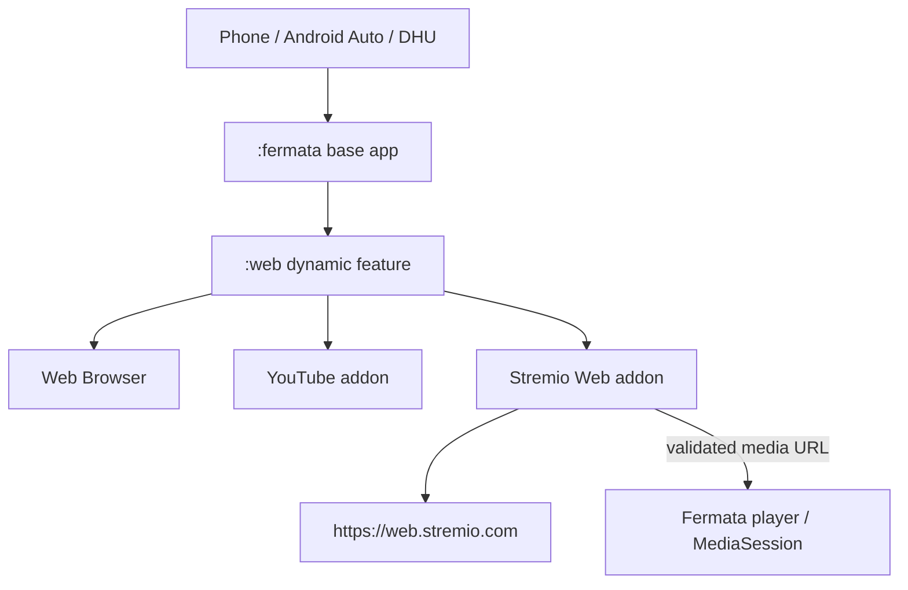
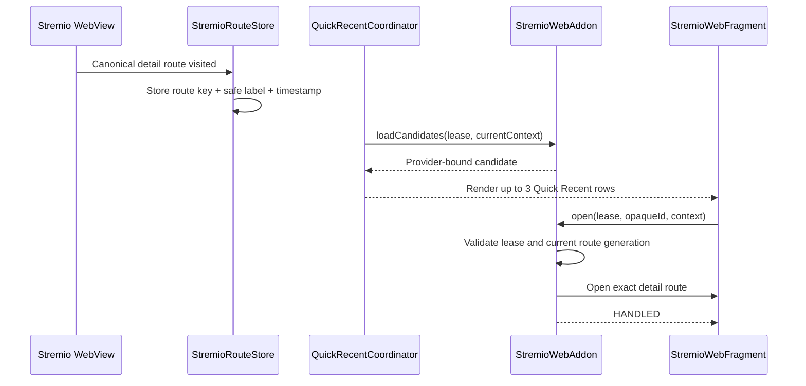

# 01 — Kiến trúc hệ thống

## 1. Architectural drivers

1. Chỉ dùng Stremio Web làm subsystem Stremio.
2. Reuse-first, ít code mới, không clone UI/protocol/runtime.
3. Một APK cho phone và Android Auto/DHU.
4. Fermata luôn là physical playback owner sau handoff.
5. Không phá architecture boundary giữa base app và dynamic features.
6. Quick Recent là navigation action, không phải playback item.
7. Mọi đường lỗi fail-closed và không tự chuyển sang runtime cũ.

## 2. Container architecture



`modules/stremio` không tồn tại trong final graph. `:web` chỉ phụ thuộc `:fermata`/`:utils` và các dependency Web hiện có. `:fermata` chỉ thấy generic contracts, không import `StremioWebAddon` hoặc class của dynamic feature.

## 3. Runtime ownership

| Domain | Authority |
|---|---|
| Account, auth, addons | Stremio Web |
| Catalog/search/library/calendar | Stremio Web |
| Details/episode/stream selection | Stremio Web |
| Web player/playerFrame/cast | Stremio Web khi user ở Web player |
| Native URL playback | Fermata player |
| MediaSession/notification/audio focus | Fermata |
| Android lifecycle/AA/DHU | Fermata |
| SmartTop Current/timeline | Fermata playback snapshot |
| Quick Recent route | Stremio Web addon stores; generic provider presents/opens |
| Continue Watching | Stremio account/Core Web; không mirror native |

Không có dual-writer cho playback state, progress hoặc Recent.

## 4. Main navigation flow

```mermaid
sequenceDiagram
    participant U as User
    participant F as StremioWebFragment
    participant W as Stremio Web
    participant C as StremioWebClient
    participant P as Fermata Player

    U->>F: Open Stremio
    F->>W: Load last canonical route or home
    W-->>F: Account/catalog/details UI
    U->>W: Select stream
    W->>C: Android external-player intent
    C->>C: Validate frame, gesture, origin and final URI
    alt Valid HTTP(S)
        C->>P: Play StremioIntentPlayable
        P-->>U: Physical playback + MediaSession
    else Invalid or unsupported
        C-->>U: Safe error; keep details page
    end
```

## 5. Quick Recent flow



Không tạo `PlayableItem`, không thêm vào `DefaultRecent`, không gọi `playItem()` và không resolve stream khi click Quick Recent.

## 6. Deployment model

Production tải origin chính thức `https://web.stremio.com/#/`.

Không vendor release ZIP, không thêm Node/pnpm/Webpack vào Gradle, không dùng `WebViewAssetLoader` và không self-host trong scope này. Lý do:

- đúng production origin cho cookie/OAuth/CORS/service worker;
- không tăng APK bằng static bundle;
- không tạo pipeline cập nhật Web thứ hai;
- giảm khác biệt với bản Web chính thức.

Đổi lại, upstream có thể thay đổi ngoài chu kỳ APK. Rủi ro này được kiểm soát bằng contract smoke test và release gate trong `07_OPERATIONS_UPSTREAM.md`.

## 7. State and persistence

### Được lưu native

- one-time onboarding acknowledged;
- last canonical Stremio detail route;
- safe display label nếu lấy được từ trusted metadata;
- timestamp;
- schema version của route store.

### Không được lưu native

- auth token/cookie;
- addon manifest credentials;
- streaming server credentials;
- final media URL;
- magnet/infohash;
- provider selection;
- player progress Stremio.

Cookie và Web storage do Android WebView quản lý. Stremio route store dùng SharedPreferences namespace riêng và không sao chép dữ liệu vào MediaLib.

## 8. Lifecycle rules

- Fragment destroy không được stop Fermata playback.
- Web renderer crash chỉ khôi phục Web surface, không thay đổi playback owner.
- `StremioWebClient.newReplacement()` phải giữ đúng subtype sau renderer recovery.
- Handoff phải debounce để một click không tạo hai `playItem()`.
- Activity/fragment phải còn hợp lệ trước khi dispatch playback hoặc navigation.
- AA shutdown dùng lifecycle hiện có của Web shell; không tạo Stremio service mới.

## 9. Unsupported architectural alternatives

- Dynamic-feature `:stremio` phụ thuộc `:web`.
- Copy các lớp WebView sang `modules/stremio`.
- Native Stremio UI/protocol/database.
- Bundled torrent/P2P server.
- JS bridge để truy cập trực tiếp Core Web state.
- DOM polling/scraping để đồng bộ progress.
- Automatic fallback sang implementation legacy.
